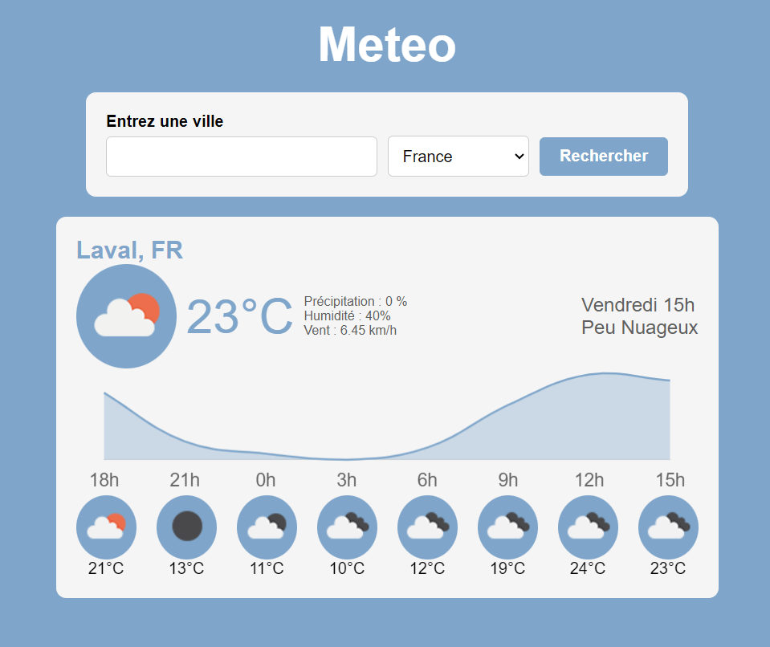

# MeteoApi

Meteo Api is a simple API that allows you to get the weather forecast for a given city. It is based on the OpenWeatherMap API.

## technologie utilisées

- Javascript
- HTML
- CSS
- OpenWeatherMap API
- Chart.js
